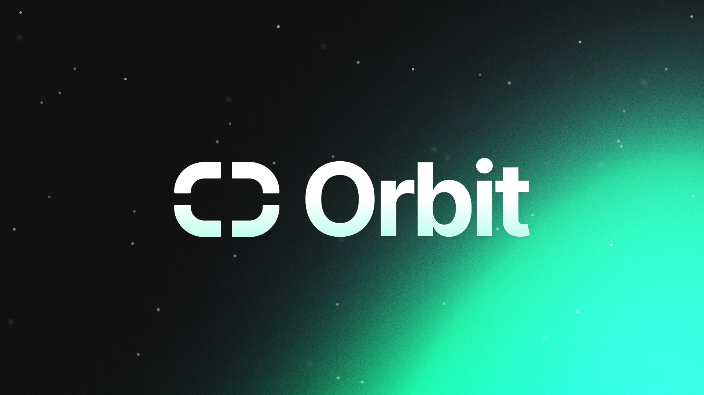

  

Orbit.js is a set of independent utilities around NATS ecosystem that aims to
boost productivity and provide higher abstraction layer for NATS Javascript
clients. Note that these libraries will evolve rapidly and API guarantees are
not made until the specific project has a v1.0.0 version.

# Utilities

This is a list of the current utilities hosted here

| Module | Description                                   | Docs                        |
| ------ | --------------------------------------------- | --------------------------- |
| NHGC   | A Javascript client for the NATS HTTP Gateway | [README.md](nhgc/README.md) |
| MuxSub | A NATS multiplexing subscription utility | [README.md](muxsub/README.md) |
| MessagePipeline | Middleware transformations for NATS messages | [README.md](messagepipeline/README.md) |
| Counters | JetStream-based atomic counter implementation | [README.md](counters/README.md) |
